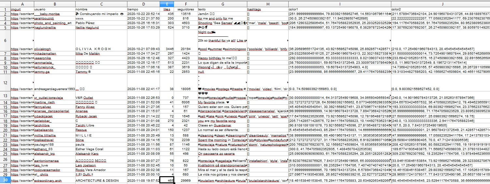

# InstagramScraper


Script orientado a extraer información de los post de la red social instagram con el fin de hacer estudio enfocado al marketing. Uno de los items más relevantes
de los dataframe son los colores dominantes de cada fotografía del post, para posterior análisis de gustos y preferencias.

Para ejecutar el script es necesario instalar la siguientes bibliotecas:
```
pip install pandas
pip install requests
pip install selenium
pip install beautifulsoup4
pip install colorthief
```

# Estructuta del Dataframe

La información de los dataframe incluye los siguiente items:
- URL post
- Nick Usuario
- Nombre Completo
- Fecha publicación
- Likes
- Followers usuario
- Texto Post
- Hashtags
- Color Dominante 1
- Color Dominante 2

# Previsualización Dataframe

<p align="center">
  
</p>

# Zenodo

10.5281/zenodo.4263896

https://zenodo.org/record/4263896#.X6kFYvNKiUk

# Licencia

Released Under CC0: Public Domain License
